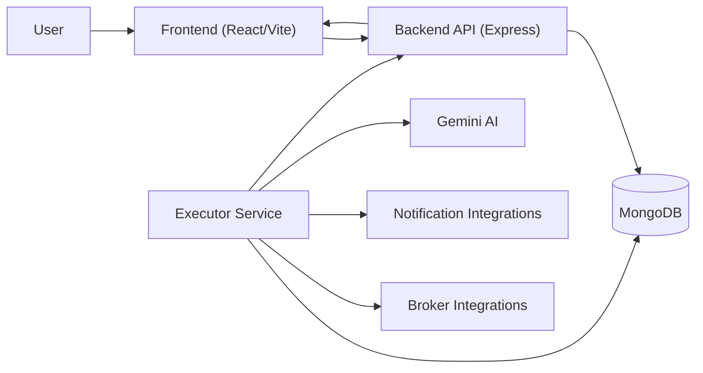

# QuantNest

QuantNest is a workflow-first trading automation platform. It lets users design visual strategies (trigger -> decision -> action), execute them continuously, and receive guided notifications with AI-generated reasoning.

This repository is a Bun/Turbo monorepo containing:
- a React frontend workflow builder,
- an Express backend API,
- an executor service that polls workflows and performs actions,
- shared packages for types, DB models, and executor utilities.

## Table of Contents
- [Overview](#overview)
- [Key Capabilities](#key-capabilities)
- [Architecture](#architecture)
- [Repository Layout](#repository-layout)
- [Tech Stack](#tech-stack)
- [Getting Started](#getting-started)
- [Environment Variables](#environment-variables)
- [Running the Platform](#running-the-platform)
- [Workflow Model](#workflow-model)
- [Execution Lifecycle](#execution-lifecycle)
- [AI Notification Reasoning](#ai-notification-reasoning)
- [API Surface](#api-surface)
- [Operational Notes](#operational-notes)
- [Troubleshooting](#troubleshooting)
- [Contributing](#contributing)
- [License](#license)

## Overview
QuantNest provides an end-to-end loop for automated trading workflows:
1. Define workflow graph in the frontend.
2. Persist workflows and credentials via backend APIs.
3. Poll and evaluate triggers in executor.
4. Execute actions (broker + notifications).
5. Record run history and show it in dashboard/executions UI.

## Key Capabilities
- Visual workflow builder with drag-and-connect node graph.
- Trigger support:
  - Timer trigger
  - Price trigger
  - Conditional trigger (indicator expression groups)
- Action support:
  - Broker actions (Zerodha, Groww, Lighter)
  - Notification actions (Gmail, Discord)
- Conditional branching (`true`/`false`) in workflow execution.
- Execution tracking (status + step-level logs).
- AI-enhanced notifications:
  - Reasoning
  - Risk factors
  - Confidence level + numeric score

## Architecture


### Service Responsibilities
- Frontend (`apps/frontend`): workflow authoring, dashboard, profile, executions view.
- Backend (`apps/backend`): auth, workflow CRUD, execution retrieval, token management.
- Executor (`apps/executor`): polling, trigger evaluation, branch routing, action execution, AI reasoning.

## Repository Layout
```text
apps/
  frontend/      React app (workflow builder + dashboard)
  backend/       Express API server
  executor/      Polling/execution worker service
packages/
  types/         Shared TS types and schemas
  db/            Mongoose models and DB exports
  executor-utils/ Shared runtime helpers (token status, market status, etc.)
  lighter-sdk-ts/ Lighter SDK + generated client
```

## Tech Stack
- Runtime: Bun, Node.js >= 18
- Monorepo orchestration: Turbo
- Frontend: React 19, Vite, Tailwind, React Flow (`@xyflow/react`)
- Backend: Express 5, Mongoose, JWT
- Executor: TypeScript + service modules, broker integrations, Resend, Gemini (`@google/genai`)
- Database: MongoDB

## Getting Started
### 1. Install dependencies
```bash
bun install
```

### 2. Create env files
Create env files for backend, executor, and frontend (see [Environment Variables](#environment-variables)).

### 3. Start each service
Run each service in a dedicated terminal (see [Running the Platform](#running-the-platform)).

## Environment Variables

### Backend (`apps/backend/.env`)
| Variable | Required | Description |
|---|---:|---|
| `MONGO_URL` | Yes | MongoDB connection string |
| `JWT_SECRET` | Yes | JWT signing/verification secret |
| `NODE_ENV` | No | Runtime mode (`development`/`production`) |

### Executor (`apps/executor/.env`)
| Variable | Required | Description |
|---|---:|---|
| `MONGO_URL` | Yes | MongoDB connection string |
| `RESEND_API_KEY` | Yes (for Gmail notifications) | Resend API key |
| `GOOGLE_API_KEY` | Recommended (for AI reasoning) | Gemini API key |

### Frontend (`apps/frontend/.env` or `.env.local`)
| Variable | Required | Description |
|---|---:|---|
| `VITE_BACKEND_URL` | Recommended | Backend base URL used by frontend HTTP client |

Example:
```env
# apps/frontend/.env.local
VITE_BACKEND_URL=http://localhost:3000/api/v1
```

## Running the Platform

### Option A: Run services explicitly (recommended)
Terminal 1 (Backend):
```bash
cd apps/backend
bun run index.ts
```

Terminal 2 (Executor):
```bash
cd apps/executor
bun run index.ts
```

Terminal 3 (Frontend):
```bash
cd apps/frontend
bun run dev
```

### Option B: Turbo commands from root
```bash
bun run dev
bun run build
bun run lint
```

## Workflow Model
A workflow is a graph of:
- `nodes`: trigger/action/conditional units
- `edges`: directed links between nodes (including branch handles)

### Trigger types
- `timer`
- `price-trigger`
- `conditional-trigger`

### Action types
- Trading: `zerodha`, `groww`, `lighter`
- Notifications: `gmail`, `discord`

### Conditional Branching
Conditional nodes expose `true` and `false` source handles. The executor evaluates condition metadata and traverses only matching branch edges.

## Execution Lifecycle
1. Executor starts and connects to MongoDB.
2. Poll loop runs every `POLL_INTERVAL` (currently 2000ms).
3. For each workflow:
   - resolve trigger type,
   - evaluate trigger condition (timer/price/conditional),
   - enforce execution cooldown,
   - execute graph recursively.
4. Each run writes step-level status to `ExecutionModel`.
5. Frontend executions page displays run history and details.

### Cooldown / Poll controls
- `apps/executor/config/constants.ts`
  - `POLL_INTERVAL = 2000`
  - `EXECUTION_COOLDOWN_MS = 5000`

## AI Notification Reasoning
QuantNest enriches notifications with guided context.

### What users receive
- concise reasoning for the setup,
- key risks,
- confidence label + score.

### How it works
1. Executor collects trigger context (`triggerType`, symbol, market, branches, timer interval).
2. If conditional expression exists, indicator references are registered.
3. For simple workflows, default indicator references are synthesized.
4. Indicator snapshots are collected and sent to Gemini as structured JSON.
5. AI response is normalized and appended to Gmail/Discord content.
6. If AI or parsing fails, deterministic fallback insight is used.

### Relevant modules
- `apps/executor/ai-models/gemini.ts`
- `apps/executor/services/indicator.engine.ts`
- `apps/executor/executors/gmail.ts`
- `apps/executor/executors/discord.ts`
- `apps/executor/executors/notificationContent.ts`

## API Surface
Base backend routes:
- `/api/v1/user`
- `/api/v1/workflow`
- `/api/v1/zerodha-token`

Examples:
- `POST /api/v1/user/signup`
- `POST /api/v1/user/signin`
- `GET /api/v1/user/profile`
- `POST /api/v1/workflow`
- `PUT /api/v1/workflow/:workflowId`
- `GET /api/v1/workflow/:workflowId`
- `GET /api/v1/workflow/getAll`
- `GET /api/v1/workflow/executions/:workflowId`
- `DELETE /api/v1/workflow/:workflowId`
- `GET /api/v1/zerodha-token/status/:workflowId`

Market status endpoint is exposed by backend as:
- `GET /market-status`

## Operational Notes
- Mongo is used by both backend and executor.
- Auth uses Bearer token (`Authorization: Bearer <token>`).
- Zerodha token lifecycle is managed per workflow/user.
- Notification delivery depends on external provider uptime and credentials.
- AI enrichment is additive; workflow notifications still send with fallback if AI is unavailable.

## Troubleshooting

### Frontend cannot reach backend
- Verify `VITE_BACKEND_URL` points to running backend.
- Confirm backend is listening on expected port.

### Executor runs but does not execute workflows
- Check Mongo connectivity (`MONGO_URL`).
- Ensure workflows contain a valid trigger node.
- Check cooldown and trigger conditions.

### Notifications not delivered
- Gmail path: verify `RESEND_API_KEY` and sender setup.
- Discord path: validate webhook URL.

### AI reasoning missing or generic
- Set `GOOGLE_API_KEY` in `apps/executor/.env`.
- Verify logs for Gemini failures.
- For simple workflows, ensure at least one symbol is discoverable or let fallback symbol path run.

## Contributing
1. Create a feature branch.
2. Keep changes scoped per service/module.
3. Run lint/build for affected apps.
4. Include migration/config notes in PR description when env/runtime behavior changes.
5. Prefer shared types in `packages/types` for cross-app contracts.

## License
See `LICENSE` at repo root.
